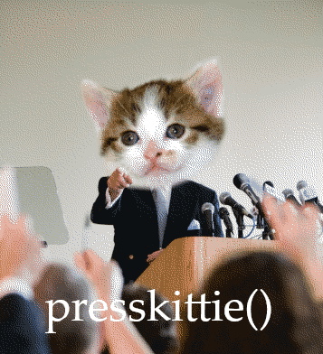
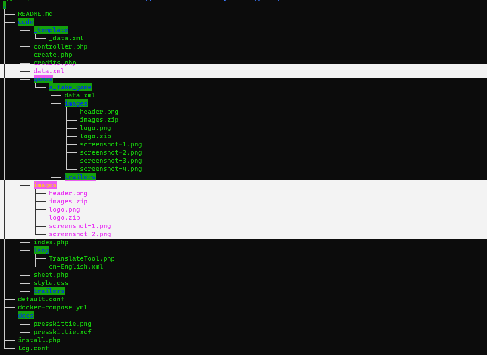
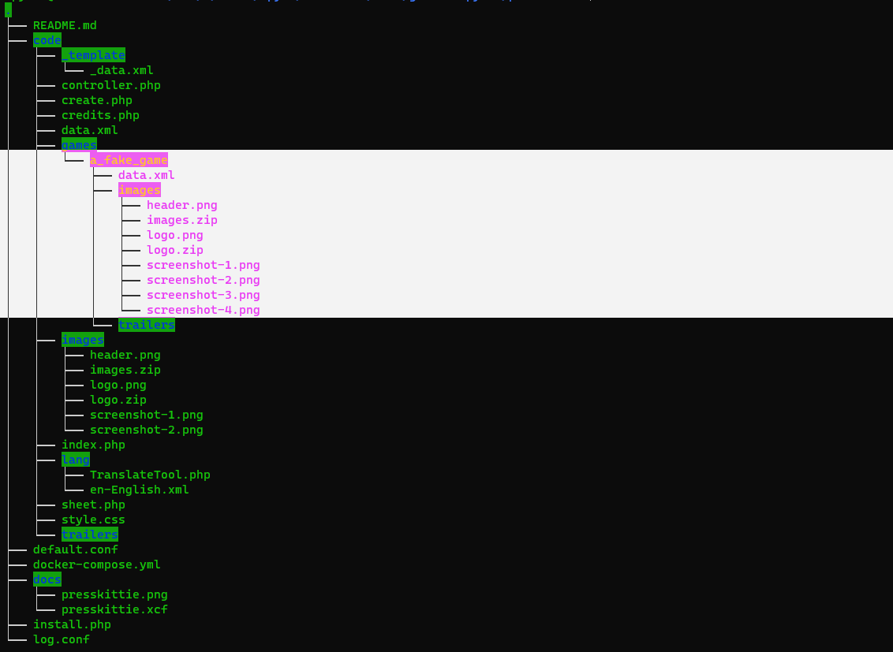
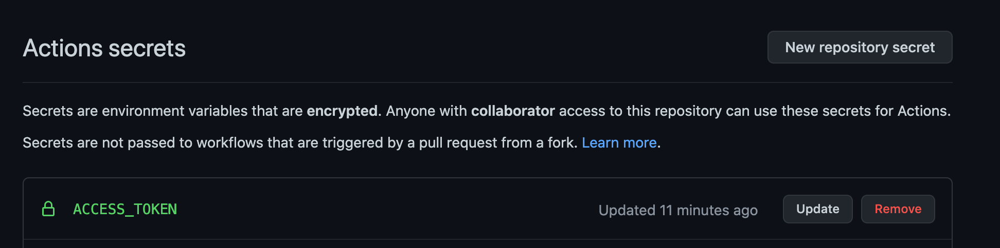
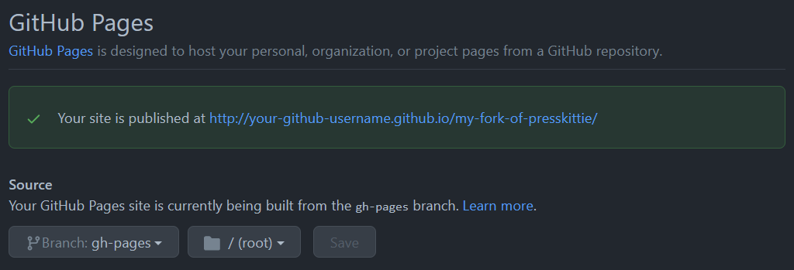

# presskittie()

**presskittie()** is [presskit()](https://dopresskit.com/) by [Rami Ismail](https://twitter.com/tha_rami), but with some conveniences:

- run and develop it locally with docker
- deploy it to Github Pages as a static site

# Why?

[presskit()](https://dopresskit.com/) contains a [PHP file](install.php), but not everyone is set up to host PHP on their websites.

 The PHP file basically downloads [this bundle](https://vlambeer.com/kit/presskit/archive.zip), which consists of more PHP files, then does a bunch of setup, but we've done all that for you. All you need to do is clone this repo, run it with Docker, customise the kit, then publish.

# A few easy steps to presskit bliss

## Run

- Download [Docker](https://www.docker.com/products/personal)
- Fork/Clone this repo
- Run it with `docker-compose up`
- View it in your browser at [http://localhost:8080](http://localhost:8080)

## Customise

This happens in two parts: 
- your studio
- your game(s)

To customise your studio presskit, modify the [code/data.xml](code/data.xml) and put new images, logo and header in [code/images](code/images). Have at least 3 screenshots.

To customise your game presskit, rename [code/games/a_fake_game](code/games/a_fake_game) to your game's name, e.g. if your game is called *Captain Kittie And The Peacekeepers*, then rename that folder to `code/games/captain_kittie_and_the_peacekeepers`.

Then modify the [code/games/a_fake_game/data.xml](code/games/a_fake_game/data.xml) and put new images, logo and header in [code/games/a_fake_game/images](code/games/a_fake_game/images). Have at least 3 screenshots.

Reload the browser to see the changes.

*Take care to prepend all websites with `https://` in the various `data.xml` files.*

## Publish

You can now let Github Actions generate a static version of the dynamic PHP stuff, and preview it via Github Pages before putting it on your own website.

Firstly, on your new repo, create an access token:

- Generate an access token in the developer settings menu of GitHub with the correct permission scope, you can name it whatever identifies the purpose of the token.
- Copy the key it generates
- Go to your repository you're running the workflow from, open `Settings` and go to the `Secrets` menu
- Click `Add new repository secret`
- Name your secret `ACCESS_TOKEN`.
- Paste the key you generated from the workflow. You should see something like this:

Now commit and push the code, and the static site will be pushed to a new branch called `gh-pages`. You might need to go to your repo's `Settings` then `Pages` and activate it there.

See your new static presskit at `http://<your-github-username>.github.io/<your-fork-of-presskittie>/`
